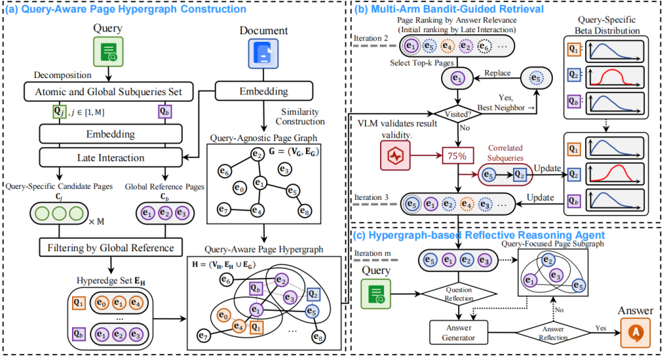

**MAB-DQA: Addressing Query Aspect Importance in Document Question Answering with Multi-Armed Bandits**  
**作者**：向一心1，马云山2，杜晓宇1*，陈怡兵3，张彦昕4，唐金辉5  
**单位**：1南京理工大学，2新加坡管理大学，3南京派米智能科技有限公司，4威斯康星大学麦迪逊分校，5南京林业大学  
**简介**：文档问答（Document Question Answering, DQA）是文档理解领域的核心任务，其核心目标是根据用户查询从目标文档中精准生成对应答案。由于该任务需充分解读文档的视觉布局信息，近年来相关研究逐步引入多模态检索增强生成（Retrieval-Augmented Generation, RAG）技术，通过对文档页面图像的有效处理辅助答案生成。然而，当前多模态RAG在视觉DQA任务中面临显著瓶颈：检索阶段通常仅保留少量候选页面，导致信息密度高但视觉辨识度较低的关键内容被忽略，而部分常见却信息量有限的页面反而被优先选取，严重影响答案生成的准确性与全面性。为解决上述问题，本文提出一种基于多臂老虎机（Multi-Armed Bandit, MAB）的DQA框架（MAB-DQA），用于显式建模用户查询中多个隐含方面的重要性差异。具体而言，MAB-DQA首先将原始查询分解为多个感知层面的子查询，为每个子查询检索专属的方面特异性候选页面集；随后将每个子查询视为一个“臂”，以少量代表性页面的初步推理结果作为奖励信号，精准估计各查询方面的效用值。在探索-利用（Exploration-Exploitation）策略的引导下，MAB-DQA可动态将检索预算重新分配给高价值查询方面，依托信息量最优的候选页面及其相关性特征，生成符合用户需求的精准答案。实验结果表明，在四个主流基准测试集上，MAB-DQA相较于现有最优方法，性能平均提升5%至18%，有效增强了模型的文档理解能力。

**代码**：https://github.com/ElephantOH/MAB-DQA