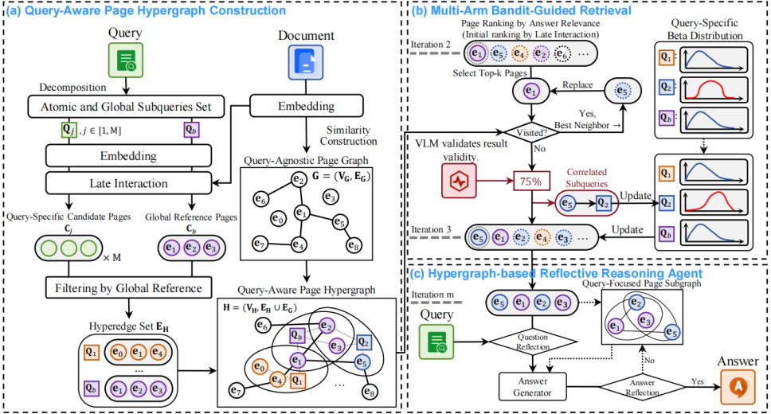

**MAB-DQA: Addressing Query Aspect Importance in Document Question Answering with Multi-Armed Bandits**

**Authors**: Yixin Xiang¹, Yunshan Ma², Xiaoyu Du¹*, Yibing Chen³, Yanxin Zhang⁴, Jinhui Tang⁵

**Affiliations**: ¹ Nanjing University of Science and Technology; ² Singapore Management University; ³ Nanjing Paimi Intelligent Technology Co., Ltd.; ⁴ University of Wisconsin–Madison; ⁵ Nanjing Forestry University

**Overview**: Document question answering (DQA) is a core task in document understanding: generating accurate answers to user queries from a target document. Because this task requires interpreting visual layouts, recent approaches have introduced multimodal retrieval-augmented generation (RAG), using document page images to support answer generation. However, multimodal RAG faces a bottleneck in visual DQA. Retrieval typically retains only a few candidate pages, overlooking information-rich content that is less visually distinctive while favoring common pages with limited information. This reduces answer accuracy and completeness.

To address this problem, we propose MAB-DQA, a DQA framework based on multi-armed bandits (MAB) that explicitly models differences in the importance of a query’s implicit aspects. MAB-DQA first decomposes a query into aspect-specific subqueries and retrieves a candidate page set for each. It then treats each subquery as an arm and uses preliminary reasoning results from a few representative pages as reward signals to estimate each aspect’s utility. Guided by an exploration–exploitation strategy, MAB-DQA dynamically reallocates the retrieval budget to high-value query aspects and generates answers using the most informative candidate pages and their relevance features. Experiments on four benchmark datasets show average performance improvements of 5%–18% over existing state-of-the-art methods, strengthening document understanding.

**Code**: https://github.com/ElephantOH/MAB-DQA
